# Use Case Diagram — SportStore

> **Cập nhật:** 03/2025  
> **Phạm vi:** Toàn bộ hệ thống SportStore (Frontend + Backend + AI Service)

---

## Sơ đồ Use Case Tổng quát

```mermaid
graph LR
    %% ===== ACTORS =====
    GUEST(["👤 Khách vãng lai\n(Guest)"])
    CUSTOMER(["🛒 Khách hàng\n(Customer)"])
    ADMIN(["🛡️ Quản trị viên\n(Admin)"])
    GEMINI(["🤖 Gemini AI\n(External)"])
    ML_SVC(["🧠 Python ML Service\n(Internal)"])
    PAYMENT(["💳 VNPay / MoMo\n(External)"])

    %% ===== SYSTEM BOUNDARY =====
    subgraph SPORTSTORE["🏪 Hệ thống SportStore"]

        subgraph UC_PUBLIC["📦 Catalog (Public)"]
            UC1["Xem trang chủ / Banner"]
            UC2["Duyệt danh sách sản phẩm"]
            UC3["Tìm kiếm & lọc sản phẩm"]
            UC4["Xem chi tiết sản phẩm"]
            UC5["Xem danh mục sản phẩm"]
            UC6["Xem thương hiệu"]
            UC36["Tra cứu bảng size"]
        end

        subgraph UC_AUTH["🔐 Xác thực"]
            UC7["Đăng ký tài khoản"]
            UC8["Đăng nhập"]
            UC9["Đăng xuất"]
        end

        subgraph UC_SHOP["🛍️ Mua sắm"]
            UC10["Quản lý giỏ hàng"]
            UC11["Áp dụng mã giảm giá"]
            UC12["Checkout / Đặt hàng"]
            UC13["Thanh toán COD"]
            UC14["Thanh toán Online"]
            UC15["Xem lịch sử đơn hàng"]
            UC16["Xem chi tiết đơn hàng"]
        end

        subgraph UC_PROFILE["👤 Hồ sơ cá nhân"]
            UC17["Xem & cập nhật profile"]
            UC18["Quản lý địa chỉ giao hàng"]
            UC19["Xem thông báo"]
            UC20["Đánh dấu thông báo đã đọc"]
        end

        subgraph UC_WISHLIST["❤️ Wishlist"]
            UC21["Thêm / xóa sản phẩm yêu thích"]
            UC22["Xem danh sách yêu thích"]
        end

        subgraph UC_REVIEW["⭐ Đánh giá"]
            UC23["Viết đánh giá sản phẩm"]
            UC24["Xem đánh giá sản phẩm"]
        end

        subgraph UC_AI["🤖 AI Features"]
            UC25["Chat với AI Chatbot"]
            UC26["Nhận gợi ý sản phẩm (Recommendation)"]
            UC27["Tracking hành vi người dùng"]
        end

        subgraph UC_ADMIN["🛡️ Quản trị"]
            UC28["CRUD Sản phẩm & Biến thể"]
            UC29["CRUD Danh mục"]
            UC30["CRUD Thương hiệu"]
            UC31["Quản lý đơn hàng & đổi trạng thái"]
            UC32["CRUD Mã giảm giá"]
            UC33["Duyệt / từ chối đánh giá"]
            UC34["Quản lý Banner / Slider"]
            UC35["Broadcast thông báo khuyến mãi"]
            UC37["CRUD Bảng size"]
        end

    end

    %% ===== GUEST CONNECTIONS =====
    GUEST --> UC1
    GUEST --> UC2
    GUEST --> UC3
    GUEST --> UC4
    GUEST --> UC5
    GUEST --> UC6
    GUEST --> UC7
    GUEST --> UC8
    GUEST --> UC24
    GUEST --> UC25
    GUEST --> UC27
    GUEST --> UC36

    %% ===== CUSTOMER CONNECTIONS =====
    CUSTOMER --> UC2
    CUSTOMER --> UC3
    CUSTOMER --> UC4
    CUSTOMER --> UC8
    CUSTOMER --> UC9
    CUSTOMER --> UC10
    CUSTOMER --> UC11
    CUSTOMER --> UC12
    CUSTOMER --> UC13
    CUSTOMER --> UC14
    CUSTOMER --> UC15
    CUSTOMER --> UC16
    CUSTOMER --> UC17
    CUSTOMER --> UC18
    CUSTOMER --> UC19
    CUSTOMER --> UC20
    CUSTOMER --> UC21
    CUSTOMER --> UC22
    CUSTOMER --> UC23
    CUSTOMER --> UC24
    CUSTOMER --> UC25
    CUSTOMER --> UC26
    CUSTOMER --> UC27
    CUSTOMER --> UC36

    %% ===== ADMIN CONNECTIONS =====
    ADMIN --> UC28
    ADMIN --> UC29
    ADMIN --> UC30
    ADMIN --> UC31
    ADMIN --> UC32
    ADMIN --> UC33
    ADMIN --> UC34
    ADMIN --> UC35
    ADMIN --> UC15
    ADMIN --> UC37

    %% ===== EXTERNAL SYSTEMS =====
    UC25 --> GEMINI
    UC26 --> ML_SVC
    UC27 --> ML_SVC
    UC14 --> PAYMENT

    %% ===== STYLING =====
    style SPORTSTORE fill:#f0f9ff,stroke:#0ea5e9,stroke-width:2px
    style UC_PUBLIC fill:#fef9c3,stroke:#eab308
    style UC_AUTH fill:#fce7f3,stroke:#ec4899
    style UC_SHOP fill:#dcfce7,stroke:#22c55e
    style UC_PROFILE fill:#ede9fe,stroke:#8b5cf6
    style UC_WISHLIST fill:#fee2e2,stroke:#ef4444
    style UC_REVIEW fill:#ffedd5,stroke:#f97316
    style UC_AI fill:#cffafe,stroke:#06b6d4
    style UC_ADMIN fill:#f1f5f9,stroke:#64748b
```



---

## Danh sách Tác nhân

| # | Tác nhân | Loại | Mô tả |
|---|---|---|---|
| 1 | **Khách vãng lai** (Guest) | Primary / Internal | Người dùng chưa đăng nhập: duyệt catalog, tìm kiếm, chat AI |
| 2 | **Khách hàng** (Customer) | Primary / Internal | Người dùng đã đăng nhập: mua hàng, wishlist, đánh giá, nhận gợi ý |
| 3 | **Quản trị viên** (Admin) | Primary / Internal | Toàn quyền quản lý hệ thống, duyệt đơn hàng và review |
| 4 | **Gemini AI** | Secondary / External | Google Gemini API — phản hồi chatbot tư vấn sản phẩm |
| 5 | **Python ML Service** | Secondary / Internal | Microservice FastAPI — tính toán gợi ý sản phẩm cá nhân hóa |
| 6 | **VNPay / MoMo** | Secondary / External | Cổng thanh toán — xử lý giao dịch online, callback kết quả |

---

## Phân loại Use Case theo Tác nhân

### 👤 Khách vãng lai (Guest)

| UC | Tên Use Case |
|----|--------------|
| UC1 | Xem trang chủ / Banner |
| UC2 | Duyệt danh sách sản phẩm |
| UC3 | Tìm kiếm & lọc sản phẩm |
| UC4 | Xem chi tiết sản phẩm |
| UC5 | Xem danh mục sản phẩm |
| UC6 | Xem thương hiệu |
| UC7 | Đăng ký tài khoản |
| UC8 | Đăng nhập |
| UC24 | Xem đánh giá sản phẩm |
| UC25 | Chat với AI Chatbot |
| UC27 | Tracking hành vi người dùng |
| UC36 | Tra cứu bảng size |

### 🛒 Khách hàng (Customer) — kế thừa Guest + thêm

| UC | Tên Use Case |
|----|--------------|
| UC9 | Đăng xuất |
| UC10 | Quản lý giỏ hàng (thêm / xóa / sửa số lượng) |
| UC11 | Áp dụng mã giảm giá |
| UC12 | Checkout / Đặt hàng |
| UC13 | Thanh toán COD |
| UC14 | Thanh toán Online (VNPay / MoMo) |
| UC15 | Xem lịch sử đơn hàng |
| UC16 | Xem chi tiết đơn hàng |
| UC17 | Xem & cập nhật profile |
| UC18 | Quản lý địa chỉ giao hàng |
| UC19 | Xem thông báo |
| UC20 | Đánh dấu thông báo đã đọc |
| UC21 | Thêm / xóa sản phẩm yêu thích |
| UC22 | Xem danh sách yêu thích |
| UC23 | Viết đánh giá sản phẩm |
| UC26 | Nhận gợi ý sản phẩm (Recommendation) |
| UC36 | Tra cứu bảng size |

### 🛡️ Quản trị viên (Admin)

| UC | Tên Use Case |
|----|--------------|
| UC15 | Xem lịch sử đơn hàng |
| UC28 | CRUD Sản phẩm & Biến thể (size, màu, tồn kho) |
| UC29 | CRUD Danh mục (đa cấp) |
| UC30 | CRUD Thương hiệu |
| UC31 | Quản lý đơn hàng & đổi trạng thái |
| UC32 | CRUD Mã giảm giá |
| UC33 | Duyệt / từ chối đánh giá sản phẩm |
| UC34 | Quản lý Banner / Slider trang chủ |
| UC35 | Broadcast thông báo khuyến mãi |
| UC37 | CRUD Bảng size (quy tắc tra cứu) |

---

## Đề xuất bổ sung Tác nhân

### 1. 👷 Nhân viên / Staff `(vai_tro: nhan_vien)`

Role trung gian giữa Admin và Customer, phục vụ vận hành hàng ngày:

| Use Case đề xuất | Lý do |
|---|---|
| Xử lý đơn hàng (xác nhận, đóng gói) | Tách bạch vận hành với quản trị hệ thống |
| Cập nhật trạng thái giao hàng | Nhân viên kho/giao vận không cần quyền admin |
| Trả lời khiếu nại / hỗ trợ khách hàng | CSKH độc lập với admin |
| Duyệt đánh giá sản phẩm | Không cần quyền admin cấp cao |

### 2. 🚚 Nhà vận chuyển / Shipping Provider (GHTK, GHN, Viettel Post)

Tích hợp API vận chuyển để tự động hóa:

| Use Case đề xuất | Lý do |
|---|---|
| Nhận webhook cập nhật trạng thái vận chuyển | Tự động `dang_giao → da_giao` thay vì admin tự bấm |
| Tạo mã vận đơn | Ghi nhận vào `lich_su_trang_thai_don` |
| Tính phí vận chuyển theo địa chỉ | `phi_van_chuyen` đang fix cứng, cần dynamic |

### 3. 📧 Email Service (SendGrid / Mailgun / SMTP)

Thông báo qua email song song với in-app notification:

| Use Case đề xuất | Lý do |
|---|---|
| Gửi email xác thực tài khoản | Trường `xac_thuc_email_luc` đã có nhưng chưa dùng |
| Email xác nhận đặt hàng | Trải nghiệm chuyên nghiệp hơn |
| Email quên mật khẩu / reset password | Chức năng quan trọng đang thiếu |
| Email thông báo trạng thái đơn hàng | Backup cho in-app notification |

### 4. 📊 Analytics System (Google Analytics / Mixpanel)

Bổ sung cho `hanh_vi_nguoi_dung` phục vụ phân tích kinh doanh:

| Use Case đề xuất | Lý do |
|---|---|
| Thu thập sự kiện tracking | Phân tích hành vi chi tiết hơn ML tracking |
| Báo cáo doanh thu / tồn kho | Admin cần dashboard tổng quan |
| Phân tích funnel conversion | Tỷ lệ xem → thêm giỏ → mua |

---

## Quan hệ kế thừa giữa các Tác nhân

```
Khách vãng lai (Guest)
    └── Khách hàng (Customer)
            └── Nhân viên / Staff [đề xuất]
                    └── Quản trị viên (Admin)
```

---

## Ghi chú

- Tất cả các use case đều nằm trong phạm vi MVP theo `.agent/SCOPE.md`
- Các tác nhân **đề xuất** chưa được implement trong codebase hiện tại
- Thứ tự ưu tiên implement theo `IMPLEMENTATION_STATUS.md`:  
  `Checkout → Orders → Chatbot Widget → Wishlist → Admin Panel → Profile`
